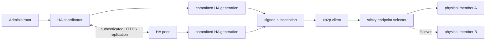
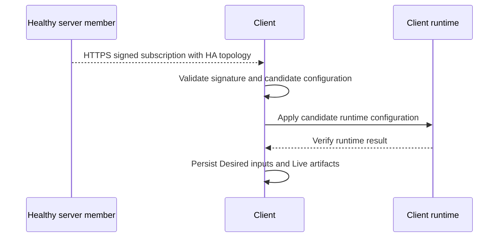
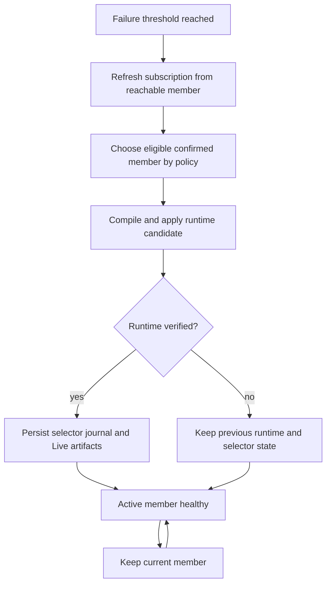

# High Availability

High Availability (HA) keeps a logical xp2p endpoint available when one server
member becomes unreachable. The server owns the HA topology and distributes it
to clients through the signed subscription. Clients do not create HA groups and
do not replicate server state.

HA separates two concerns:

- The **control plane** commits and replicates the group topology, stable
  reverse channels, redirect policy, identity ACLs, and provisioned metadata.
- The **data plane** carries tunnel traffic through the currently selected
  physical member. It remains usable while the control plane is temporarily
  unavailable, provided that the active member and its local configuration are
  healthy.

## Architecture



An HA group has a stable logical identity. Its members are physical server
endpoints with priority and lifecycle state. The group also owns stable reverse
channels and redirect policy, so a client or a remote reverse consumer does not
need to change its logical target when the active physical member changes.

## State Model

The committed HA generation is the unit of replication. It contains:

- group identity and selector policy;
- member records, including priority, confirmed state, and tombstones;
- stable reverse channel definitions;
- group-owned redirect rules;
- identity ACL generation and provisioned metadata.

The generation deliberately does not contain a client's transient active
member. That choice is local client runtime state and must not be replicated to
other clients.

| State | Owner | Purpose |
| --- | --- | --- |
| Desired inputs | administrator and management commands | durable intended configuration |
| Committed HA generation | HA server peers | replicated logical topology |
| Live artifacts | service/runtime | configuration currently applied to Xray |
| Selector journal | each client | last known active member and health decisions |

When a runtime-capable operation succeeds, its Desired inputs and matching Live
artifacts are committed together. If the runtime is stopped, the change is
staged in Desired inputs and is applied by the next service run.

## Server Control Plane

Every server peer stores the same committed generation. A deterministic
coordinator proposes a candidate generation, gathers acknowledgements, and
commits it only after quorum. Peer membership, election, and witness data make
the decision process deterministic when several servers are available.

```mermaid
sequenceDiagram
    participant A as Coordinator
    participant B as HA peer
    participant C as Witness or peer
    A->>A: Build and validate candidate generation
    A->>B: POST /control/v1/ha/prepare
    A->>C: POST /control/v1/ha/prepare
    B-->>A: Acknowledge staged candidate
    C-->>A: Acknowledge staged candidate
    A->>A: Quorum reached; commit locally
    A->>B: POST /control/v1/ha/commit
    A->>C: POST /control/v1/ha/commit
    B->>B: Commit atomically
    C->>C: Commit atomically
```

Preparation validates the candidate and stages it without replacing the active
generation. A peer acknowledges only a valid candidate. If quorum is not
reached, staged data is aborted and the previous committed generation remains
active. A receiver also compiles the affected state before acknowledging, so a
replicated topology cannot be committed when it cannot produce a valid local
configuration.

Replication changes HA-owned resources only. It does not overwrite node-local
settings such as listener placement or unrelated local server configuration.

### Membership Safety

Membership changes follow the same quorum protocol as topology changes. A new
member is added and confirmed before it participates in decisions. Removing a
member leaves a tombstone in the generation, preventing an older replica from
silently reintroducing it. Reprioritizing a member changes the preferred target
without changing the logical group identity.

Normal recovery uses the regular peer and synchronization workflow. Emergency
force reconfiguration is reserved for a two-voter deployment that has lost a
peer permanently. It requires an explicit reason and authorization because it
intentionally bypasses the ordinary safety margin.

## Subscription Distribution

The control listener serves signed subscriptions over HTTPS. Clients refresh
their subscription on the normal healthy interval and also after endpoint
failure or credential-rotation paths. The subscription carries the committed HA
topology and member TLS metadata needed to contact each physical endpoint.



The client retains its last known good subscription and runtime configuration
when a newer subscription cannot be validated or applied. Receiving topology is
therefore not itself a disruptive failover action.

Control-plane HTTPS uses authenticated HMAC requests between HA peers. TLS must
be verified through a trusted chain or an explicit self-signed certificate pin.
Client subscriptions use the same HTTPS transport guarantees appropriate to the
configured endpoint metadata.

## Client Selection and Failover

Each client runs a selector for every subscribed endpoint group. The selector is
sticky: it keeps the active member while that member remains healthy, avoiding
unnecessary oscillation. Health checks use the existing tunnel path and record
successes and failures per physical endpoint.

The selector policy includes:

- automatic, manual, or disabled selection mode;
- failure and success thresholds;
- cooldown and minimum hold periods;
- automatic failback behavior;
- member priority.



The client changes the runtime target only after the candidate configuration has
been compiled, applied, and verified. It then persists the selector state in
the client Live artifacts. A stale persisted active member is self-healed when
the selector observes that it is no longer eligible.

An administratively disabled endpoint is not a failover event. It is excluded
by policy and must not be selected merely because another member is unhealthy.

HA improves new connection availability. It does not migrate an already open
application TCP session from one physical member to another; connections using
the failed member can be interrupted and are re-established by their caller.

## Stable Reverse Channels and Redirects

Reverse channels are attached to the logical group, not to a transient active
member. Every confirmed member exposes the same logical reverse portal and the
same group-owned redirect policy. During a member switch, the portal and domain
identity remain stable while the physical transport endpoint changes.

This also applies to group identity ACLs and provisioned metadata. They are
part of the replicated generation so a newly confirmed peer can provide the
same logical service before clients select it.

## Operational Workflow

The usual server-side lifecycle is:

1. Create or update the group on a server peer.
2. Add and confirm physical members with their endpoint and TLS metadata.
3. Configure HA peers, voter membership, and any witness.
4. Run synchronization so peers receive the committed generation.
5. Start or refresh clients normally; they receive the topology by subscription.
6. Observe health and selector decisions; clients switch only when policy
   conditions are met.

Useful inspection commands use their default parameters:

```text
xp2p server ha status
xp2p client group list
```

`xp2p server ha status` reports local HA generation and peer state. Client group
inspection shows the subscribed group topology and selector state. Management
commands for groups, members, channels, peers, and synchronization should be
used to change the server-owned topology; clients should never be configured by
creating a parallel local HA group.

## Troubleshooting

Start with these boundaries when diagnosing an incident:

1. Verify that a committed generation exists on the primary peer and that the
   intended peer has synchronized it.
2. Verify that the peer can compile and expose the same subscription topology.
3. Verify that the client has refreshed the topology and sees confirmed members.
4. Check health records, thresholds, cooldown, and hold time before expecting a
   selector switch.
5. Check that the runtime candidate applied successfully; a failed candidate
   must leave the last known good runtime active.

Logs are stored under `XP2P_LOG_ROOT` (`/var/log/xp2p` by default). For detailed
selector and replication diagnostics, use the `debug` log level in an Advanced
or test-specific environment. Failure dumps should include the full `.state`
tree so Desired, Live, last-known-good, and apply error markers can be compared.

Related flows: [Apply Flow](apply-flow.md),
[Config Compilation](config-compilation.md), and
[Tunnel Status Logic](tunnel-status.md).
