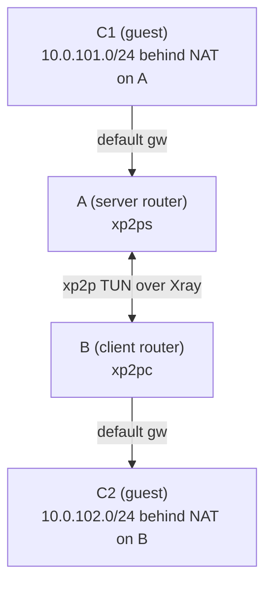

# Chain (C2-B-A-C1)

This chain sends traffic from C2 through B and A to reach C1.

## Diagram



## Assumptions

- A = router running `xp2p server`, B = router running `xp2p client`.
- C1 is behind A (`10.0.101.0/24`), C2 is behind B (`10.0.102.0/24`).
- The A-B tunnel is already working and both sides run in TUN mode.
- C1 uses A as its default gateway, and C2 uses B as its default gateway.

## Redirects (routes are installed on A and B)

When TUN is enabled, `xp2p {client,server} redirect add --cidr ...` compiles into OS routes on the routers (A/B) during apply. You do not need to add routes manually on C1/C2.

```console
xp2p client redirect add --cidr 10.0.101.0/24
xp2p server redirect add --cidr 10.0.102.0/24
```

Apply the changes by restarting the services using your service manager (for example `service xp2p-client restart` / `service xp2p-server restart` on OpenWrt, or `systemctl restart xp2p-client xp2p-server` on systemd-based systems).

## OpenWrt firewall

Bind the xp2p TUN interface to a firewall zone and allow LAN <-> tunnel forwarding.

If you can reach the remote subnet from the router itself (for example A can reach `10.0.102.1`), but hosts behind the router cannot, this almost always means the firewall does not allow forwarding between `lan` and the tunnel zone. You must explicitly allow `lan -> xp2ptun` (and usually `xp2ptun -> lan`) forwarding.

On B (client, `xp2pc`), create a zone and allow `lan -> xp2pc` forwarding:

```console
uci delete firewall.xp2c 2>/dev/null || true
uci set firewall.xp2c='zone'
uci set firewall.xp2c.name='xp2c'
uci set firewall.xp2c.network='xp2pc'
uci set firewall.xp2c.input='REJECT'
uci set firewall.xp2c.output='ACCEPT'
uci set firewall.xp2c.forward='ACCEPT'

uci add firewall forwarding
uci set firewall.@forwarding[-1].src='lan'
uci set firewall.@forwarding[-1].dest='xp2c'

uci commit firewall
/etc/init.d/firewall restart
```

### Advanced

- Return traffic: if you need traffic from the tunnel back into LAN, also add an `xp2c -> lan` forwarding.
- Server side: on A (server, `xp2ps`), create the same zone but set `firewall.xp2c.network='xp2ps'`.

## Verify

On B (client router), verify that C1 is reachable through the tunnel using `xp2p ping`:

```console
xp2p ping 10.0.101.1
```

### Advanced

The command sends an HTTPS control ping through the selected tunnel endpoint.
