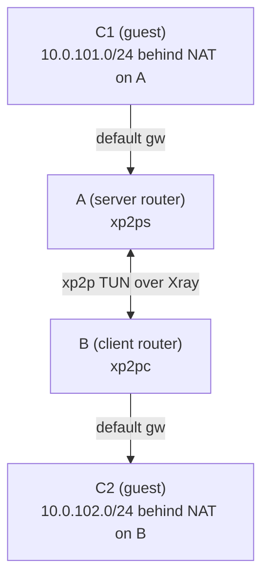

# Chain (C2-B-A-C1)

This chain sends traffic from C2 through B and A to reach C1.

## Diagram



## Assumptions

- A = router running `xp2p server`, B = router running `xp2p client`.
- C1 is behind A (`10.0.101.0/24`), C2 is behind B (`10.0.102.0/24`).
- The A-B tunnel is already working and both sides run in TUN mode.
- C1 uses A as its default gateway, and C2 uses B as its default gateway.

## Redirects (routes are installed on A and B)

When TUN is enabled, `xp2p {client,server} redirect add --cidr ...` compiles into OS routes on the routers (A/B) during apply. You do not need to add routes manually on C1/C2.

```sh
xp2p client redirect add --cidr 10.0.101.0/24
xp2p server redirect add --cidr 10.0.102.0/24
```

Apply the changes by restarting the services using your service manager (for example `service xp2p-client restart` / `service xp2p-server restart` on OpenWrt, or `systemctl restart xp2p-client xp2p-server` on systemd-based systems).

## OpenWrt firewall

Bind the xp2p TUN interface to a firewall zone and allow LAN <-> tunnel forwarding.

On B (client, `xp2pc`):

```sh
uci -q delete firewall.xp2ptun
uci set firewall.xp2ptun='zone'
uci set firewall.xp2ptun.name='xp2ptun'
uci set firewall.xp2ptun.network='xp2pc'
uci set firewall.xp2ptun.input='ACCEPT'
uci set firewall.xp2ptun.output='ACCEPT'
uci set firewall.xp2ptun.forward='ACCEPT'

uci add firewall forwarding
uci set firewall.@forwarding[-1].src='lan'
uci set firewall.@forwarding[-1].dest='xp2ptun'

uci add firewall forwarding
uci set firewall.@forwarding[-1].src='xp2ptun'
uci set firewall.@forwarding[-1].dest='lan'

uci commit firewall
/etc/init.d/firewall restart
```

On A (server, `xp2ps`), mirror the same rules but set `firewall.xp2ptun.network='xp2ps'`.

## Verify

On B (client router), verify that C1 is reachable through the tunnel using `xp2p ping`. Pick a port that is known to be open on C1 (for example `22/tcp` for SSH):

```sh
xp2p ping 10.0.101.1 --tunnel --proto tcp --port 22
```
