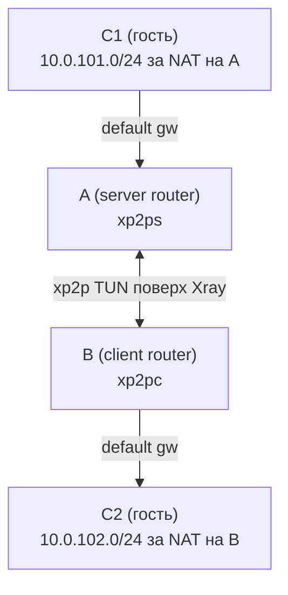

# Цепочка (C2–B–A–C1)

Эта цепочка отправляет трафик из C2 через B и A, чтобы достичь C1.

## Схема



## Предпосылки

- A = роутер с `xp2p server`, B = роутер с `xp2p client`.
- C1 находится за A (`10.0.101.0/24`), C2 находится за B (`10.0.102.0/24`).
- Туннель A–B уже работает, и обе стороны запущены в режиме TUN.
- C1 использует A как default gateway, а C2 использует B как default gateway.

## Редиректы (маршруты ставятся на A и B)

Когда включён TUN, `xp2p {client,server} redirect add --cidr ...` компилируется в маршруты ОС на роутерах (A/B) во время apply. Ручные маршруты на C1/C2 добавлять не нужно.

```sh
xp2p client redirect add --cidr 10.0.101.0/24
xp2p server redirect add --cidr 10.0.102.0/24
```

Примени изменения перезапуском сервисов через service manager (например `service xp2p-client restart` / `service xp2p-server restart` на OpenWrt или `systemctl restart xp2p-client xp2p-server` на системах с systemd).

## OpenWrt firewall

Привяжи TUN-интерфейс xp2p к firewall zone и разреши LAN <-> tunnel forwarding.

На B (client, `xp2pc`):

```sh
uci -q delete firewall.xp2ptun
uci set firewall.xp2ptun='zone'
uci set firewall.xp2ptun.name='xp2ptun'
uci set firewall.xp2ptun.network='xp2pc'
uci set firewall.xp2ptun.input='ACCEPT'
uci set firewall.xp2ptun.output='ACCEPT'
uci set firewall.xp2ptun.forward='ACCEPT'

uci add firewall forwarding
uci set firewall.@forwarding[-1].src='lan'
uci set firewall.@forwarding[-1].dest='xp2ptun'

uci add firewall forwarding
uci set firewall.@forwarding[-1].src='xp2ptun'
uci set firewall.@forwarding[-1].dest='lan'

uci commit firewall
/etc/init.d/firewall restart
```

На A (server, `xp2ps`) сделай то же самое, но поставь `firewall.xp2ptun.network='xp2ps'`.

## Проверка

На B (client router) проверь, что C1 доступен через туннель с помощью `xp2p ping`. Выбери порт, который точно открыт на C1 (например `22/tcp` для SSH):

```sh
xp2p ping 10.0.101.1 --tunnel --proto tcp --port 22
```
