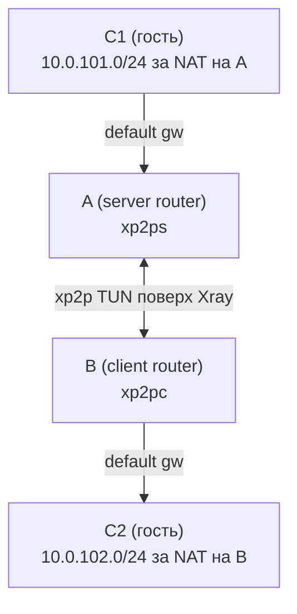

# Цепочка (C2–B–A–C1)

Эта цепочка отправляет трафик из C2 через B и A, чтобы достичь C1.

## Схема



## Предпосылки

- A = роутер с `xp2p server`, B = роутер с `xp2p client`.
- C1 находится за A (`10.0.101.0/24`), C2 находится за B (`10.0.102.0/24`).
- Туннель A–B уже работает, и обе стороны запущены в режиме TUN.
- C1 использует A как default gateway, а C2 использует B как default gateway.

## Редиректы (маршруты ставятся на A и B)

Когда включён TUN, `xp2p {client,server} redirect add --cidr ...` компилируется в маршруты ОС на роутерах (A/B) во время apply. Ручные маршруты на C1/C2 добавлять не нужно.

```console
xp2p client redirect add --cidr 10.0.101.0/24
xp2p server redirect add --cidr 10.0.102.0/24
```

Примени изменения перезапуском сервисов через service manager (например `service xp2p-client restart` / `service xp2p-server restart` на OpenWrt или `systemctl restart xp2p-client xp2p-server` на системах с systemd).

## OpenWrt firewall

Привяжи TUN-интерфейс xp2p к firewall zone и разреши LAN <-> tunnel forwarding.

Если удалённая сеть доступна с самого роутера (например, A может достучаться
до `10.0.102.1`), но недоступна хостам за роутером, почти всегда это означает,
что firewall не разрешает forwarding между `lan` и tunnel zone. Нужно явно
разрешить forwarding `lan -> xp2ptun` (и обычно `xp2ptun -> lan`).

На B (client, `xp2pc`) создай zone и разреши forwarding `lan -> xp2pc`:

```console
uci delete firewall.xp2c 2>/dev/null || true
uci set firewall.xp2c='zone'
uci set firewall.xp2c.name='xp2c'
uci set firewall.xp2c.network='xp2pc'
uci set firewall.xp2c.input='REJECT'
uci set firewall.xp2c.output='ACCEPT'
uci set firewall.xp2c.forward='ACCEPT'

uci add firewall forwarding
uci set firewall.@forwarding[-1].src='lan'
uci set firewall.@forwarding[-1].dest='xp2c'

uci commit firewall
/etc/init.d/firewall restart
```

### Advanced

- Return traffic: если нужен трафик из туннеля обратно в LAN, добавь также
  forwarding `xp2c -> lan`.
- Server side: на A (server, `xp2ps`) создай такую же zone, но поставь
  `firewall.xp2c.network='xp2ps'`.

## Проверка

На B (client router) проверь доступность C1 через туннель с помощью `xp2p ping`:

```console
xp2p ping 10.0.101.1
```

### Advanced

Команда отправляет HTTPS control ping через выбранный tunnel endpoint.
